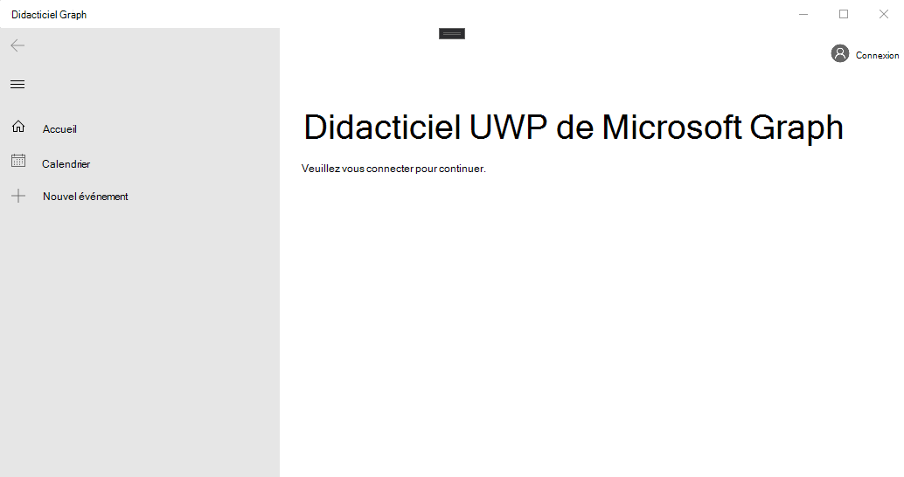

<!-- markdownlint-disable MD002 MD041 -->

<span data-ttu-id="f955f-101">Ouvrez Visual Studio, puis sélectionnez **créer un nouveau projet**.</span><span class="sxs-lookup"><span data-stu-id="f955f-101">Open Visual Studio, and select **Create a new project**.</span></span> <span data-ttu-id="f955f-102">Choisissez l’option **application vierge (Windows universel)** qui utilise C#, puis sélectionnez **suivant**.</span><span class="sxs-lookup"><span data-stu-id="f955f-102">Choose the **Blank App (Universal Windows)** option that uses C#, then select **Next**.</span></span>


<span data-ttu-id="f955f-104">Dans la boîte de dialogue **configurer votre nouveau projet** , entrez `graph-tutorial` dans le champ **nom du projet** et sélectionnez **créer**.</span><span class="sxs-lookup"><span data-stu-id="f955f-104">In the **Configure your new project** dialog, enter `graph-tutorial` in the **Project name** field and select **Create**.</span></span>


> [!IMPORTANT]
> <span data-ttu-id="f955f-106">Assurez-vous d’entrer exactement le même nom pour le projet Visual Studio spécifié dans ces instructions d’atelier.</span><span class="sxs-lookup"><span data-stu-id="f955f-106">Ensure that you enter the exact same name for the Visual Studio Project that is specified in these lab instructions.</span></span> <span data-ttu-id="f955f-107">Le nom du projet Visual Studio devient partie intégrante de l’espace de noms dans le code.</span><span class="sxs-lookup"><span data-stu-id="f955f-107">The Visual Studio Project name becomes part of the namespace in the code.</span></span> <span data-ttu-id="f955f-108">Le code à l’intérieur de ces instructions dépend de l’espace de noms correspondant au nom de projet Visual Studio spécifié dans ces instructions.</span><span class="sxs-lookup"><span data-stu-id="f955f-108">The code inside these instructions depends on the namespace matching the Visual Studio Project name specified in these instructions.</span></span> <span data-ttu-id="f955f-109">Si vous utilisez un nom de projet différent, le code n’est pas compilé, sauf si vous ajustez tous les espaces de noms pour qu’ils correspondent au nom de projet Visual Studio que vous entrez lors de la création du projet.</span><span class="sxs-lookup"><span data-stu-id="f955f-109">If you use a different project name the code will not compile unless you adjust all the namespaces to match the Visual Studio Project name you enter when you create the project.</span></span>

<span data-ttu-id="f955f-110">Sélectionnez **OK**.</span><span class="sxs-lookup"><span data-stu-id="f955f-110">Select **OK**.</span></span> <span data-ttu-id="f955f-111">Dans la boîte de dialogue **nouveau projet de plateforme Windows universelle** , vérifiez que la **version minimale** est définie sur `Windows 10 Fall Creators Update (10.0; Build 16299)` ou version ultérieure, puis sélectionnez **OK**.</span><span class="sxs-lookup"><span data-stu-id="f955f-111">In the **New Universal Windows Platform Project** dialog, ensure that the **Minimum version** is set to `Windows 10 Fall Creators Update (10.0; Build 16299)` or later and select **OK**.</span></span>

<span data-ttu-id="f955f-112">Avant de poursuivre, installez des packages NuGet supplémentaires que vous utiliserez plus tard.</span><span class="sxs-lookup"><span data-stu-id="f955f-112">Before moving on, install some additional NuGet packages that you will use later.</span></span>

- <span data-ttu-id="f955f-113">[Microsoft. Toolkit. UWP. UI. Controls](https://www.nuget.org/packages/Microsoft.Toolkit.Uwp.Ui.Controls/) pour ajouter des contrôles d’interface utilisateur pour les notifications et les indicateurs de chargement dans l’application.</span><span class="sxs-lookup"><span data-stu-id="f955f-113">[Microsoft.Toolkit.Uwp.Ui.Controls](https://www.nuget.org/packages/Microsoft.Toolkit.Uwp.Ui.Controls/) to add some UI controls for in-app notifications and loading indicators.</span></span>
- <span data-ttu-id="f955f-114">[Microsoft. Toolkit. UWP. UI. Controls. DataGrid](https://www.nuget.org/packages/Microsoft.Toolkit.Uwp.Ui.Controls.DataGrid/) pour afficher les informations renvoyées par Microsoft Graph.</span><span class="sxs-lookup"><span data-stu-id="f955f-114">[Microsoft.Toolkit.Uwp.Ui.Controls.DataGrid](https://www.nuget.org/packages/Microsoft.Toolkit.Uwp.Ui.Controls.DataGrid/) to display the information returned by Microsoft Graph.</span></span>
- <span data-ttu-id="f955f-115">[Microsoft. Toolkit. UWP. UI. Controls. Graph](https://www.nuget.org/packages/Microsoft.Toolkit.Uwp.Ui.Controls.Graph/) pour gérer l’extraction des jetons d’accès et de connexion.</span><span class="sxs-lookup"><span data-stu-id="f955f-115">[Microsoft.Toolkit.Uwp.Ui.Controls.Graph](https://www.nuget.org/packages/Microsoft.Toolkit.Uwp.Ui.Controls.Graph/) to handle login and access token retrieval.</span></span>
- <span data-ttu-id="f955f-116">[Microsoft. Graph](https://www.nuget.org/packages/Microsoft.Graph/) pour effectuer des appels à Microsoft Graph.</span><span class="sxs-lookup"><span data-stu-id="f955f-116">[Microsoft.Graph](https://www.nuget.org/packages/Microsoft.Graph/) for making calls to the Microsoft Graph.</span></span>

<span data-ttu-id="f955f-117">Sélectionnez **outils > gestionnaire de package NuGet > console Gestionnaire de package**.</span><span class="sxs-lookup"><span data-stu-id="f955f-117">Select **Tools > NuGet Package Manager > Package Manager Console**.</span></span> <span data-ttu-id="f955f-118">Dans la console Gestionnaire de package, entrez les commandes suivantes.</span><span class="sxs-lookup"><span data-stu-id="f955f-118">In the Package Manager Console, enter the following commands.</span></span>

```Powershell
Install-Package Microsoft.Toolkit.Uwp.Ui.Controls -Version 6.0.0
Install-Package Microsoft.Toolkit.Uwp.Ui.Controls.DataGrid -Version 6.0.0
Install-Package Microsoft.Toolkit.Uwp.Ui.Controls.Graph -Version 6.0.0
Install-Package Microsoft.Graph -Version 1.20.0
```

## <a name="design-the-app"></a><span data-ttu-id="f955f-119">Concevoir l’application</span><span class="sxs-lookup"><span data-stu-id="f955f-119">Design the app</span></span>

<span data-ttu-id="f955f-120">Commencez par ajouter une variable au niveau de l’application pour effectuer le suivi de l’état d’authentification.</span><span class="sxs-lookup"><span data-stu-id="f955f-120">Start by adding an application-level variable to track authentication state.</span></span> <span data-ttu-id="f955f-121">Dans l’Explorateur de solutions, développez **app. Xaml** et ouvrez **app.Xaml.cs**.</span><span class="sxs-lookup"><span data-stu-id="f955f-121">In Solution Explorer, expand **App.xaml** and open **App.xaml.cs**.</span></span> <span data-ttu-id="f955f-122">Ajoutez la propriété suivante à la `App` classe.</span><span class="sxs-lookup"><span data-stu-id="f955f-122">Add the following property to the `App` class.</span></span>

```cs
public bool IsAuthenticated { get; set; }
```

<span data-ttu-id="f955f-123">Définissez ensuite la disposition de la page principale.</span><span class="sxs-lookup"><span data-stu-id="f955f-123">Next, define the layout for the main page.</span></span> <span data-ttu-id="f955f-124">Ouvrez `MainPage.xaml` et remplacez l’intégralité de son contenu par ce qui suit.</span><span class="sxs-lookup"><span data-stu-id="f955f-124">Open `MainPage.xaml` and replace its entire contents with the following.</span></span>

```xml
<Page
    x:Class="graph_tutorial.MainPage"
    xmlns="http://schemas.microsoft.com/winfx/2006/xaml/presentation"
    xmlns:x="http://schemas.microsoft.com/winfx/2006/xaml"
    xmlns:local="using:graph_tutorial"
    xmlns:d="http://schemas.microsoft.com/expression/blend/2008"
    xmlns:mc="http://schemas.openxmlformats.org/markup-compatibility/2006"
    xmlns:controls="using:Microsoft.Toolkit.Uwp.UI.Controls"
    xmlns:graphControls="using:Microsoft.Toolkit.Uwp.UI.Controls.Graph"
    mc:Ignorable="d"
    Background="{ThemeResource ApplicationPageBackgroundThemeBrush}">

    <Grid>
        <NavigationView x:Name="NavView"
            IsSettingsVisible="False"
            ItemInvoked="NavView_ItemInvoked">

            <NavigationView.Header>
                <graphControls:AadLogin x:Name="Login"
                    HorizontalAlignment="Left"
                    View="SmallProfilePhotoLeft"
                    AllowSignInAsDifferentUser="False"
                    />
            </NavigationView.Header>

            <NavigationView.MenuItems>
                <NavigationViewItem Content="Home" x:Name="Home" Tag="home">
                    <NavigationViewItem.Icon>
                        <FontIcon Glyph="&#xE10F;"/>
                    </NavigationViewItem.Icon>
                </NavigationViewItem>
                <NavigationViewItem Content="Calendar" x:Name="Calendar" Tag="calendar">
                    <NavigationViewItem.Icon>
                        <FontIcon Glyph="&#xE163;"/>
                    </NavigationViewItem.Icon>
                </NavigationViewItem>
            </NavigationView.MenuItems>

            <StackPanel>
                <controls:InAppNotification x:Name="Notification" ShowDismissButton="true" />
                <Frame x:Name="RootFrame" Margin="24, 0" />
            </StackPanel>
        </NavigationView>
    </Grid>
</Page>
```

<span data-ttu-id="f955f-125">Cela définit un [NavigationView](https://docs.microsoft.com/uwp/api/windows.ui.xaml.controls.navigationview) de base avec des liens de navigation **Accueil** et **calendrier** pour agir en tant que vue principale de l’application.</span><span class="sxs-lookup"><span data-stu-id="f955f-125">This defines a basic [NavigationView](https://docs.microsoft.com/uwp/api/windows.ui.xaml.controls.navigationview) with **Home** and **Calendar** navigation links to act as the main view of the app.</span></span> <span data-ttu-id="f955f-126">Il ajoute également un contrôle [AadLogin](https://docs.microsoft.com/dotnet/api/microsoft.toolkit.uwp.ui.controls.graph.aadlogin?view=win-comm-toolkit-dotnet-stable) dans l’en-tête de la vue.</span><span class="sxs-lookup"><span data-stu-id="f955f-126">It also adds an [AadLogin](https://docs.microsoft.com/dotnet/api/microsoft.toolkit.uwp.ui.controls.graph.aadlogin?view=win-comm-toolkit-dotnet-stable) control in the header of the view.</span></span> <span data-ttu-id="f955f-127">Ce contrôle permettra à l’utilisateur de se connecter et de se déconnecter. Le contrôle n’est pas encore entièrement activé, vous le configurerez dans un exercice ultérieur.</span><span class="sxs-lookup"><span data-stu-id="f955f-127">That control will allow the user to sign in and out. The control isn't fully enabled yet, you will configure it in a later exercise.</span></span>

<span data-ttu-id="f955f-128">Maintenant, ajoutez une autre page XAML pour le mode Accueil.</span><span class="sxs-lookup"><span data-stu-id="f955f-128">Now add another XAML page for the Home view.</span></span> <span data-ttu-id="f955f-129">Cliquez avec le bouton droit sur le projet du **didacticiel Graph** dans l’Explorateur de solutions et sélectionnez **Ajouter > nouvel élément...**. Choisissez **page vierge**, entrez `HomePage.xaml` dans le champ **nom** , puis sélectionnez **Ajouter**.</span><span class="sxs-lookup"><span data-stu-id="f955f-129">Right-click the **graph-tutorial** project in Solution Explorer and select **Add > New Item...**. Choose **Blank Page**, enter `HomePage.xaml` in the **Name** field, and select **Add**.</span></span> <span data-ttu-id="f955f-130">Ajoutez le code suivant à l' `<Grid>` intérieur de l’élément dans le fichier.</span><span class="sxs-lookup"><span data-stu-id="f955f-130">Add the following code inside the `<Grid>` element in the file.</span></span>

```xml
<StackPanel>
    <TextBlock FontSize="44" FontWeight="Bold" Margin="0, 12">Microsoft Graph UWP Tutorial</TextBlock>
    <TextBlock x:Name="HomePageMessage">Please sign in to continue.</TextBlock>
</StackPanel>
```

<span data-ttu-id="f955f-131">Maintenant, développez **MainPage. Xaml** dans l’Explorateur `MainPage.xaml.cs`de solutions et ouvrez.</span><span class="sxs-lookup"><span data-stu-id="f955f-131">Now expand **MainPage.xaml** in Solution Explorer and open `MainPage.xaml.cs`.</span></span> <span data-ttu-id="f955f-132">Ajoutez la fonction suivante à la `MainPage` classe pour gérer l’état de l’authentification.</span><span class="sxs-lookup"><span data-stu-id="f955f-132">Add the following function to the `MainPage` class to manage authentication state.</span></span>

```cs
private void SetAuthState(bool isAuthenticated)
{
    (App.Current as App).IsAuthenticated = isAuthenticated;

    // Toggle controls that require auth
    Calendar.IsEnabled = isAuthenticated;
}
```

<span data-ttu-id="f955f-133">Ajoutez le code suivant au `MainPage()` constructeur **après** la `this.InitializeComponent();` ligne.</span><span class="sxs-lookup"><span data-stu-id="f955f-133">Add the following code to the `MainPage()` constructor **after** the `this.InitializeComponent();` line.</span></span>

```cs
// Initialize auth state to false
SetAuthState(false);

// Navigate to HomePage.xaml
RootFrame.Navigate(typeof(HomePage));
```

<span data-ttu-id="f955f-134">Lorsque l’application démarre pour la première fois, elle Initialise l’état d' `false` authentification et accède à la page d’accueil.</span><span class="sxs-lookup"><span data-stu-id="f955f-134">When the app first starts, it will initialize the authentication state to `false` and navigate to the home page.</span></span>

<span data-ttu-id="f955f-135">Ajoutez le gestionnaire d’événements suivant pour charger la page demandée lorsque l’utilisateur sélectionne un élément dans l’affichage de navigation.</span><span class="sxs-lookup"><span data-stu-id="f955f-135">Add the following event handler to load the requested page when the user selects an item from the navigation view.</span></span>

```cs
private void NavView_ItemInvoked(NavigationView sender, NavigationViewItemInvokedEventArgs args)
{
    var invokedItem = args.InvokedItem as string;

    switch (invokedItem.ToLower())
    {
        case "calendar":
            throw new NotImplementedException();
            break;
        case "home":
        default:
            RootFrame.Navigate(typeof(HomePage));
            break;
    }
}
```

<span data-ttu-id="f955f-136">Enregistrez toutes vos modifications, appuyez sur **F5** ou sélectionnez **débogage > démarrer le débogage** dans Visual Studio.</span><span class="sxs-lookup"><span data-stu-id="f955f-136">Save all of your changes, then press **F5** or select **Debug > Start Debugging** in Visual Studio.</span></span>

> [!NOTE]
> <span data-ttu-id="f955f-137">Assurez-vous que vous sélectionnez la configuration appropriée pour votre ordinateur (ARM, x64, x86).</span><span class="sxs-lookup"><span data-stu-id="f955f-137">Make sure you select the appropriate configuration for your machine (ARM, x64, x86).</span></span>


