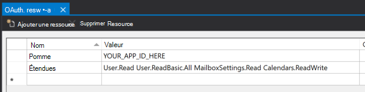

<!-- markdownlint-disable MD002 MD041 -->

Dans cet exercice, vous allez étendre l’application de l’exercice précédent pour prendre en charge l’authentification avec Azure AD. Cela est nécessaire pour obtenir le jeton d’accès OAuth nécessaire pour appeler Microsoft Graph. Dans cette étape, vous allez intégrer le contrôle [AadLogin](https://docs.microsoft.com/dotnet/api/microsoft.toolkit.uwp.ui.controls.graph.aadlogin?view=win-comm-toolkit-dotnet-stable) de la boîte à outils de la [communauté Windows](https://github.com/Microsoft/WindowsCommunityToolkit) dans l’application.

Cliquez avec le bouton droit sur le projet du **didacticiel Graph** dans l’Explorateur de solutions et sélectionnez **Ajouter > nouvel élément...**. Sélectionnez le **fichier de ressources (. resw)**, nommez le fichier `OAuth.resw` , puis sélectionnez **Ajouter**. Lorsque le nouveau fichier s’ouvre dans Visual Studio, créez deux ressources comme suit.

- **Nom:** `AppId` **Valeur:** ID de l’application que vous avez généré dans le portail d’inscription des applications
- **Nom:** `Scopes` **Valeur:**`User.Read Calendars.Read`



> [!IMPORTANT]
> Si vous utilisez le contrôle de code source tel que git, il est maintenant recommandé d’exclure le `OAuth.resw` fichier du contrôle de code source afin d’éviter une fuite accidentelle de votre ID d’application.

## <a name="configure-the-aadlogin-control"></a>Configurer le contrôle AadLogin

Commencez par ajouter du code pour lire les valeurs du fichier de ressources. Ouvrez `MainPage.xaml.cs` et ajoutez l’instruction `using` suivante en haut du fichier.

```cs
using Microsoft.Toolkit.Services.MicrosoftGraph;
```

Remplacez la ligne `RootFrame.Navigate(typeof(HomePage));` par le code suivant.

```cs
// Load OAuth settings
var oauthSettings = Windows.ApplicationModel.Resources.ResourceLoader.GetForCurrentView("OAuth");
var appId = oauthSettings.GetString("AppId");
var scopes = oauthSettings.GetString("Scopes");

if (string.IsNullOrEmpty(appId) || string.IsNullOrEmpty(scopes))
{
    Notification.Show("Could not load OAuth Settings from resource file.");
}
else
{
    // Initialize Graph
    MicrosoftGraphService.Instance.AuthenticationModel = MicrosoftGraphEnums.AuthenticationModel.V2;
    MicrosoftGraphService.Instance.Initialize(appId,
        MicrosoftGraphEnums.ServicesToInitialize.UserProfile,
        scopes.Split(' '));

    // Navigate to HomePage.xaml
    RootFrame.Navigate(typeof(HomePage));
}
```

Ce code charge les paramètres à `OAuth.resw` partir de et initialise l’instance globale de `MicrosoftGraphService` à l’aide de ces valeurs.

À présent, ajoutez un gestionnaire d' `SignInCompleted` événements pour l' `AadLogin` événement sur le contrôle. Ouvrez le `MainPage.xaml` fichier et remplacez l’élément `<graphControls:AadLogin>` existant par ce qui suit.

```xml
<graphControls:AadLogin x:Name="Login"
    HorizontalAlignment="Left"
    View="SmallProfilePhotoLeft"
    AllowSignInAsDifferentUser="False"
    SignInCompleted="Login_SignInCompleted"
    SignOutCompleted="Login_SignOutCompleted"
    />
```

Ajoutez ensuite les fonctions suivantes à la `MainPage` classe dans `MainPage.xaml.cs`.

```cs
private void Login_SignInCompleted(object sender, Microsoft.Toolkit.Uwp.UI.Controls.Graph.SignInEventArgs e)
{
    // Set the auth state
    SetAuthState(true);
    // Reload the home page
    RootFrame.Navigate(typeof(HomePage));
}

private void Login_SignOutCompleted(object sender, EventArgs e)
{
    // Set the auth state
    SetAuthState(false);
    // Reload the home page
    RootFrame.Navigate(typeof(HomePage));
}
```

Enfin, dans l’Explorateur de solutions, développez **homepage. Xaml** et ouvrez `HomePage.xaml.cs`. Ajoutez le code suivant après la `this.InitializeComponent();` ligne.

```cs
if ((App.Current as App).IsAuthenticated)
{
    HomePageMessage.Text = "Welcome! Please use the menu to the left to select a view.";
}
```

Redémarrez l’application et cliquez sur le contrôle **de connexion** en haut de l’application. Une fois que vous êtes connecté, l’interface utilisateur doit changer pour indiquer que vous avez réussi à vous connecter.


> [!NOTE]
> Le `AadLogin` contrôle implémente la logique de stockage et d’actualisation du jeton d’accès pour vous. Les jetons sont stockés dans un emplacement de stockage sécurisé et actualisés en fonction des besoins.
