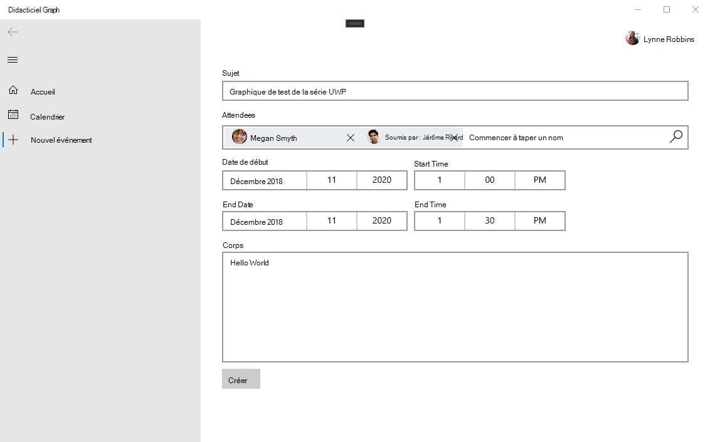

<!-- markdownlint-disable MD002 MD041 -->

Dans cette section, vous allez ajouter la possibilité de créer des événements dans le calendrier de l’utilisateur.

1. Ajoutez une nouvelle page pour la nouvelle vue de l’événement. Cliquez avec le bouton droit sur le projet **GraphTutorial** dans l’Explorateur de solutions et sélectionnez **Ajouter > nouvel élément...**. Choisissez **page vierge**, entrez `NewEventPage.xaml` dans le champ **nom** , puis sélectionnez **Ajouter**.

1. Ouvrez **NewEventPage. Xaml** et remplacez son contenu par ce qui suit.

    :::code language="xaml" source="../demo/GraphTutorial/NewEventPage.xaml" id="NewEventPageXamlSnippet":::

1. Ouvrez **NewEventPage.Xaml.cs** et ajoutez les `using` instructions suivantes en haut du fichier.

    :::code language="csharp" source="../demo/GraphTutorial/NewEventPage.xaml.cs" id="UsingStatementsSnippet":::

1. Ajoutez l’interface **INotifyPropertyChange** à la classe **NewEventPage** . Remplacez la déclaration de classe existante par ce qui suit.

    ```csharp
    public sealed partial class NewEventPage : Page, INotifyPropertyChanged
    {
        public NewEventPage()
        {
            this.InitializeComponent();
            DataContext = this;
        }
    }
    ```

1. Ajoutez les propriétés suivantes à la classe **NewEventPage** .

    :::code language="csharp" source="../demo/GraphTutorial/NewEventPage.xaml.cs" id="PropertiesSnippet":::

1. Ajoutez le code suivant pour obtenir le fuseau horaire de l’utilisateur à partir de Microsoft Graph lors du chargement de la page.

    :::code language="csharp" source="../demo/GraphTutorial/NewEventPage.xaml.cs" id="LoadTimeZoneSnippet":::

1. Ajoutez le code suivant pour créer l’événement.

    :::code language="csharp" source="../demo/GraphTutorial/NewEventPage.xaml.cs" id="CreateEventSnippet":::

1. Modifiez la `NavView_ItemInvoked` méthode dans le fichier **MainPage.Xaml.cs** pour remplacer l' `switch` instruction existante par ce qui suit.

    ```csharp
    switch (invokedItem.ToLower())
    {
        case "new event":
            RootFrame.Navigate(typeof(NewEventPage));
            break;
        case "calendar":
            RootFrame.Navigate(typeof(CalendarPage));
            break;
        case "home":
        default:
            RootFrame.Navigate(typeof(HomePage));
            break;
    }
    ```

1. Enregistrez vos modifications et exécutez l’application. Connectez-vous, sélectionnez l’élément de menu **nouvel événement** , remplissez le formulaire, puis sélectionnez **créer** pour ajouter un événement au calendrier de l’utilisateur.

    
